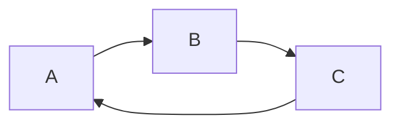
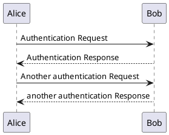
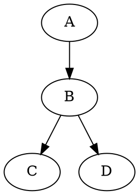

[TOC]

## 标准标题写法
# 这是 `<h1>` 一级标题  {ignore=true}
## 这是 `<h2>` 二级标题  {ignore=true}
### 这是 `<h3>` 三级标题  {ignore=true}
#### 这是 `<h4>` 四级标题  {ignore=true}
##### 这是 `<h5>` 五级标题  {ignore=true}
###### 这是 `<h6>` 六级标题  {ignore=true}

## 扩展标题写法
# 这个标题拥有一个 id # {#my_id ignore = true}
# 这个标题拥有二个 classes # {.class1 .class2 ignore = true}

*这会是 斜体 的文字*
_这会是 粗体 的文字_
**这会是 粗体 的文字**
__这会是 粗体 的文字__

_你也可以 **组合** 这些符号

~~这个文字将会被横线删除~~

## 列表
### 无序列表
 * Item1
 * Item2
 * Item3
    * Item3_1
    * Item3_2
### 有序列表
1. Item1
2. Item2
3. Item3
    1. Item3a
    2. Item3b

Volumes/OSX/Projects/guibiaoguo.github.io/markdown-preview-enchance.pdf --toc --toc-depth=2 --pdf-engine=pdflatex [WARNING] Could not fetch resource 'url': replacing image with description pdflatex not found. Please select a different --pdf-engine or install pdflatex


Format: 
[GitHub](http://github.com)

正如 Kanye West 所说
> We're living the future so
> the present is out past.
---
***
___

`<addr>`

```ruby
require 'redcarpet'
markdown = Redcarpet.new("Hello World!")
puts markdown.to_html
```
```java
class Test implements Serializable {
  private static final long serialVersionUID = 42l;
  public static void main(String[] args) {
    System.out.println("Hello World!");
  }
}
```

```javascript {.line-numbers}
function add(x, y) {
  return x + y
}
```

## 任务列表
- [x] todo
- [ ] add ass,vtt
- [x] markdonw

## 表格
| First Header       | Second Header                |
| ------------------ | ---------------------------- |
| Content from ceil1 | Content in the second column |
|                    |                              |

colspan `>` or `empty ceil`:
| a   | b   |
| --- | --- |
| >   | 1   |
| 2   |     |
rowspan `>`
| a   | b   |
| ---| --- |
| 1   | 2   |
| ^   | 4   |
## Emoji
:smile:
:fa-car:

## 上标
30^th^

## 下标
H~2~O

## 脚注
Content [^1]
[^1]: Hi! This is a footnote

## 缩略
*[HTML]: Hyper Text Markup Language
*[W3C]: World Wide Web Consortium
The HTML specification
is maintained by the W3C.

## 标记
==marked==

{==高亮==}
{--删除--}
{~~test~>back~~}
{>>注释<<}
## 数学

### Accents
| $a'$         | $\tilde{a}$      | $\mathring{g}$        |
| ------------ | ---------------- | --------------------- |
| $a''$        | $\widetilde{ac}$ | $\overgroup{AB}$      |
| $a^{\prime}$ | $\utilde{AB}$    | $ \undergroup{AB}$    |
| $\acute{a}$  | $\vec{F}$        | $\Overrightarrow{AB}$ |
$$
\begin{matrix}
   a & b \\
   c & d
\end{matrix}
$$
$f(x) = sin(x) + 12$
$$\sum_{n=1}*100$$

## 流程图
### Flow Charts
```flow {filename="flow.png"}
st=>start: 开始
op=>operation: My Operation
cond=>condition: Yes or No?
test=>condition: test flow
e=>end
st->op->cond
cond(yes)->test
test(yes)->e
cond(no)->op
```
### sequence
```sequence {theme="hand" filename="sequence.png"}
Andrew->China: Says Hello
Note right of China: China thinks\nabout it
Note left of Andrew: Andrew is test
China-->Andrew: How are you?
Andrew->>China: I am good thanks!
```
### mermaid

### puml {filename="puml.png"}

### wavedrom
```wavedrom {filename="wavedrom.png"}
{signal: [
  {name: 'clk', wave: 'p.....|...'},
  {name: 'dat', wave: 'x.345x|=.x', data: ['head', 'body', 'tail', 'data']},
  {name: 'req', wave: '0.1..0|1.0'},
  {},
  {name: 'ack', wave: '1.....|01.'}
]}
```
### dot && viz


### Vega && Vega-lite
```vega-lite
{
  "$schema": "https://vega.github.io/schema/vega-lite/v2.json",
  "description": "A simple bar chart with embedded data.",
  "data": {
    "values": [
      {"a": "A","b": 20},{"a": "B","b": 55},
      {"a": "C","b": 43},{"a": "D","b": 91},
      {"a": "E","b": 81},{"a": "F","b": 53},
      {"a": "G","b": 19},{"a": "H","b": 87},
      {"a": "I","b": 52}
    ]
  },
  "mark": "bar",
  "encoding": {
    "x": {"field": "a", "type": "ordinal"},
    "y": {"field": "b", "type": "quantitative"}
  },
  "width": 500,
  "height": 400
}
```
```vega
{
  "$schema": "https://vega.github.io/schema/vega/v4.json",
  "width": 500,
  "height": 200,
  "padding": 5,

  "data": [
    {
      "name": "table",
      "values": [
        {"x": 0, "y": 28, "c":0}, {"x": 0, "y": 55, "c":1},
        {"x": 1, "y": 43, "c":0}, {"x": 1, "y": 91, "c":1},
        {"x": 2, "y": 81, "c":0}, {"x": 2, "y": 53, "c":1},
        {"x": 3, "y": 19, "c":0}, {"x": 3, "y": 87, "c":1},
        {"x": 4, "y": 52, "c":0}, {"x": 4, "y": 48, "c":1},
        {"x": 5, "y": 24, "c":0}, {"x": 5, "y": 49, "c":1},
        {"x": 6, "y": 87, "c":0}, {"x": 6, "y": 66, "c":1},
        {"x": 7, "y": 17, "c":0}, {"x": 7, "y": 27, "c":1},
        {"x": 8, "y": 68, "c":0}, {"x": 8, "y": 16, "c":1},
        {"x": 9, "y": 49, "c":0}, {"x": 9, "y": 15, "c":1}
      ],
      "transform": [
        {
          "type": "stack",
          "groupby": ["x"],
          "sort": {"field": "c"},
          "field": "y"
        }
      ]
    }
  ],

  "scales": [
    {
      "name": "x",
      "type": "band",
      "range": "width",
      "domain": {"data": "table", "field": "x"}
    },
    {
      "name": "y",
      "type": "linear",
      "range": "height",
      "nice": true, "zero": true,
      "domain": {"data": "table", "field": "y1"}
    },
    {
      "name": "color",
      "type": "ordinal",
      "range": "category",
      "domain": {"data": "table", "field": "c"}
    }
  ],

  "axes": [
    {"orient": "bottom", "scale": "x", "zindex": 1},
    {"orient": "left", "scale": "y", "zindex": 1}
  ],

  "marks": [
    {
      "type": "rect",
      "from": {"data": "table"},
      "encode": {
        "enter": {
          "x": {"scale": "x", "field": "x"},
          "width": {"scale": "x", "band": 1, "offset": -1},
          "y": {"scale": "y", "field": "y0"},
          "y2": {"scale": "y", "field": "y1"},
          "fill": {"scale": "color", "field": "c"}
        },
        "update": {
          "fillOpacity": {"value": 1}
        },
        "hover": {
          "fillOpacity": {"value": 0.5}
        }
      }
    }
  ]
}
```
### Ditaa
```ditaa {cmd=true args=["-E"] filename="ditaa.png"}
+--------+   +-------+    +-------+
|        | --+ ditaa +--> |       |
|  Text  |   +-------+    |diagram|
|Document|   |!magic!|    |       |
|     {d}|   |       |    |       |
+---+----+   +-------+    +-------+
    :                         ^
    |       Lots of work      |
    +-------------------------+
```
### 导入外部文件
@import "credit_user.csv"
@import "ALICE.pdf"
@import "readme1.py" {class="line-numbers"}

## code code_chunk

### bash
```bash {cmd=true}
ls .
```

### javascript
```javascript {cmd="node"}
const date = Date.now()
console.log(date.toString())
```

### python
```python {cmd="/usr/local/bin/python3"}
print("这个将会运行 python3 程序")
```

```python {cmd=true matplotlib=true}
import matplotlib.pyplot as plt
plt.plot([1,2,3, 4])
plt.show() # show figure
```

```gnuplot {cmd=true output="html"}
set terminal svg
set title "Simple Plots" font ",20"
set key left box
set samples 50
set style data points

plot [-10:10] sin(x),atan(x),cos(atan(x))
```
```erd {cmd=true output="html" args=["-i", "$input_file", "-f", "svg"]}

[Person]
*name
height
weight
+birth_location_id

[Location]
*id
city
state
country

Person *--1 Location
```
## 图片助手


